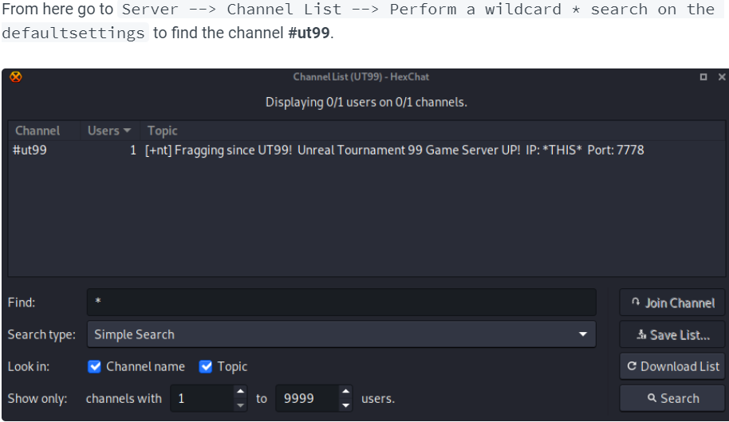

# Shenzi

#### Starting of with a Nmap scan

 (1).png>)

#### Checking for smbclient

 (1).png>)

Doing guess work we can use this as a directory on the webpage

 (1).png>)

**Enumeration of smbmap**

 (1).png>)

 (1).png>)

 (1).png>)

**Now we have some passwords that can be used to login into wordpress**

 (1).png>)

### Foothold

We can upload a webshell

.png>)

Browsing to the webpage we have it running and executing commands

 (1).png>)

Uploading nc.exe and getting a proper shell

.png>)

&#x20;

Running winpeas on the target shows

.png>)

I made a exe using msfvenom

.png>)

Got it on my shell and ran it with a lister listening

.png>)

And got an admin shell&#x20;

.png>)

